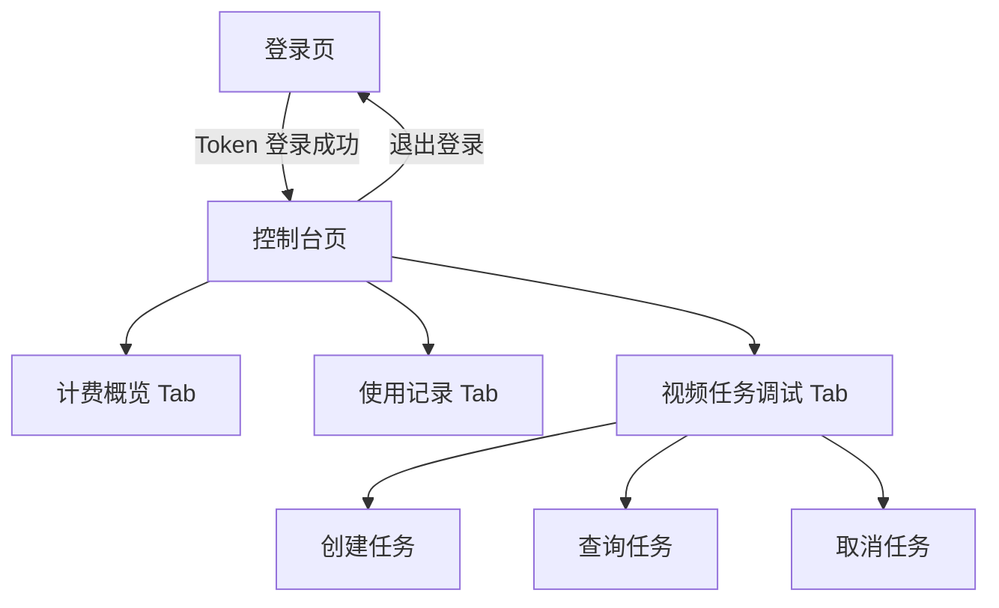

## 1. Product Overview

面向已持有 Token 的用户提供一个前端控制台：登录后查看计费/使用记录，并进行视频任务 API 调试（创建/查询/取消）。
帮助用户快速验证接口与排查问题，提升集成效率。

## 2. Core Features

### 2.1 User Roles

| 角色       | 注册/登录方式                  | 核心权限                             |
| -------- | ------------------------ | -------------------------------- |
| Token 用户 | 通过输入 Token 登录（本地保存/退出清除） | 查看计费与使用记录；创建/查询/取消视频任务；查看任务请求/响应 |

### 2.2 Feature Module

产品由以下主要页面组成：

1. **登录页**：Token 输入与校验、登录状态提示。
2. **控制台页**：计费概览、使用记录列表、视频任务 API 调试（创建/查询/取消）、请求/响应日志。

### 2.3 Page Details

| Page Name | Module Name   | Feature description                          |
| --------- | ------------- | -------------------------------------------- |
| 登录页       | Token 登录表单    | 输入 Token；基础格式校验；点击登录后保存到本地会话；失败时展示错误原因       |
| 登录页       | 登录状态与引导       | 展示当前是否已登录；提供“前往控制台/退出登录”入口                   |
| 控制台页      | 顶部导航与会话       | 展示产品名与当前登录状态；支持退出登录（清除本地 Token 并跳转登录）        |
| 控制台页      | Tab：计费概览      | 拉取并展示计费信息（如余额/额度/结算周期等，以接口返回为准）；支持手动刷新       |
| 控制台页      | Tab：使用记录      | 按时间倒序展示使用记录；支持时间范围筛选与刷新；点击单条记录查看更多字段（抽屉/弹窗）  |
| 控制台页      | Tab：视频任务调试-创建 | 填写创建任务所需参数；一键发起创建请求；展示请求体、响应体与生成的 task\_id   |
| 控制台页      | Tab：视频任务调试-查询 | 输入 task\_id 查询任务；展示任务状态与关键字段；支持轮询/停止轮询（用于调试） |
| 控制台页      | Tab：视频任务调试-取消 | 输入 task\_id 发起取消；展示取消结果与错误信息                 |
| 控制台页      | 调试日志与复制       | 统一展示最近 N 次请求的时间、接口、耗时、状态码（如有）；支持复制请求/响应 JSON |

## 3. Core Process

1. Token 用户首次进入：打开登录页 → 输入 Token → 点击登录 → 成功后进入控制台。
2. 查看计费：进入控制台 → 切换到“计费概览” → 自动拉取并展示 → 用户可手动刷新。
3. 查看使用记录：切换到“使用记录” → 设置时间范围（可选） → 拉取列表 → 点击单条查看详情。
4. 调试视频任务：切换到“视频任务调试”

* 创建：填写参数 → 点击创建 → 获取 task\_id → 记录请求/响应。

* 查询：输入 task\_id → 点击查询或开启轮询 → 观察状态变化。

* 取消：输入 task\_id → 点击取消 → 查看结果。

1. 退出：点击退出登录 → 清除本地 Token → 回到登录页。

