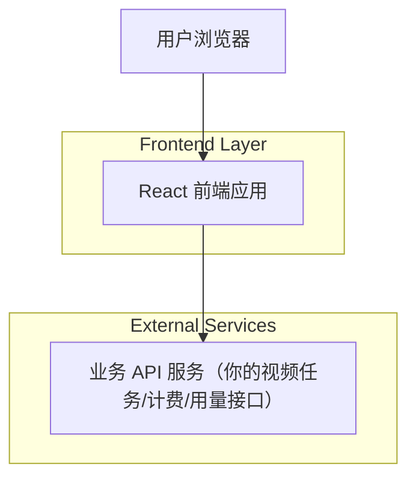

## 1.Architecture design

## 2.Technology Description
- Frontend: React@18 + TypeScript + vite + tailwindcss
- Backend: None（前端直接调用业务 API；通过 Token 进行鉴权）

## 3.Route definitions
| Route | Purpose |
|-------|---------|
| /login | Token 登录页：输入/保存 Token、跳转控制台 |
| /console | 控制台：计费/使用记录、视频任务 API 调试（创建/查询/取消） |

## 4.API definitions (If it includes backend services)
本方案不包含自建后端服务；前端按你现有 API 文档直接调用。

前端统一请求约定（建议）：
- 鉴权：`Authorization: Bearer <token>`（或按你现有约定）
- 请求记录：在前端封装 fetch/axios 拦截器，统一记录接口名、请求体、响应体、耗时、错误信息，用于“调试日志”。

## 6.Data model(if applicable)
不引入数据库。
- Token：存储在浏览器本地（建议 localStorage），退出登录清除。
- 调试日志：可仅存内存（刷新丢失）或存 localStorage（按产品需要选择）。
